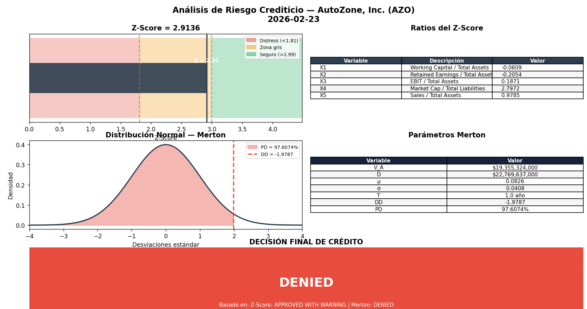
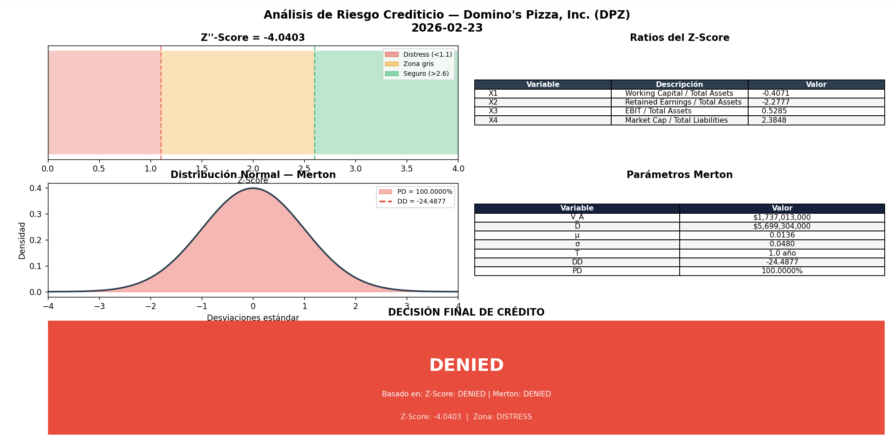
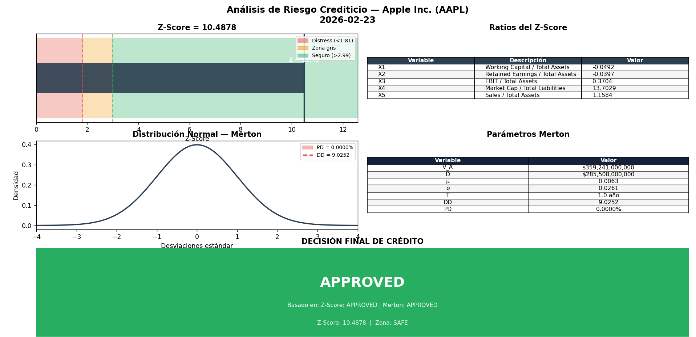

# Sistema de Análisis de Riesgo Crediticio
## Altman Z-Score + Modelo de Merton

**Curso:** Modelos de Crédito  
**Fecha:** Febrero 2026

---

## Índice

1. [Descripción General](#descripción-general)
2. [Fundamento Teórico](#fundamento-teórico)
   - [Altman Z-Score](#altman-z-score)
   - [Modelo de Merton](#modelo-de-merton)
3. [Arquitectura del Sistema](#arquitectura-del-sistema)
4. [Descripción de Módulos](#descripción-de-módulos)
5. [Fuentes de Datos](#fuentes-de-datos)
6. [Instrucciones de Uso](#instrucciones-de-uso)
7. [Limitantes del Sistema](#limitantes-del-sistema)
8. [Ejemplos y Resultados](#ejemplos-y-resultados)
9. [Conclusiones](#conclusiones)

---

## Descripción General

Este proyecto implementa un sistema de análisis de riesgo crediticio orientado a objetos (OOP) en Python, que combina dos modelos cuantitativos ampliamente utilizados en finanzas:

- **Altman Z-Score** (1968): modelo estadístico basado en ratios financieros para predecir probabilidad de quiebra.
- **Modelo de Merton** (1974): modelo estructural que trata el equity de una empresa como una opción sobre sus activos.

El sistema descarga datos financieros directamente desde Yahoo Finance para cualquier ticker bursátil, clasifica la empresa automáticamente, calcula ambos modelos, emite una decisión crediticia y genera un reporte visual con gráficas.

---

## Fundamento Teórico

### Altman Z-Score

El Z-Score de Altman fue desarrollado por Edward Altman en 1968 mediante análisis discriminante múltiple (MDA) sobre una muestra de empresas manufactureras públicas. El modelo combina cinco ratios financieros ponderados en un único puntaje que predice la probabilidad de quiebra en un horizonte de dos años.

#### Versiones del modelo

El paper de Altman define tres variantes según el tipo de empresa:

| Versión | Aplicación | Fórmula |
|---------|-----------|---------|
| **Z** | Manufactureras públicas | Z = 1.2X₁ + 1.4X₂ + 3.3X₃ + 0.6X₄ + 1.0X₅ |
| **Z'** | Empresas privadas | Z' = 0.717X₁ + 0.847X₂ + 3.107X₃ + 0.420X₄ + 0.998X₅ |
| **Z''** | No manufactureras / mercados emergentes | Z'' = 6.56X₁ + 3.26X₂ + 6.72X₃ + 1.05X₄ |

> **Nota:** El sistema implementa Z y Z''. Z' no se implementa porque todos los tickers analizados son empresas públicas.

#### Variables

| Variable | Fórmula | Concepto |
|----------|---------|---------|
| X₁ | Working Capital / Total Assets | Liquidez operativa |
| X₂ | Retained Earnings / Total Assets | Rentabilidad acumulada |
| X₃ | EBIT / Total Assets | Productividad de activos |
| X₄ | Market Cap / Total Liabilities | Solvencia de mercado |
| X₅ | Sales / Total Assets | Eficiencia de activos (solo en Z) |

#### Zonas de clasificación

| Modelo Z | Modelo Z'' | Zona | Decisión |
|----------|-----------|------|---------|
| > 2.99 | > 2.60 | Segura | APPROVED |
| 1.81 – 2.99 | 1.10 – 2.60 | Gris | APPROVED WITH WARNING |
| < 1.81 | < 1.10 | Distress | DENIED |

---

### Modelo de Merton

El modelo de Merton (1974) conceptualiza el equity de una empresa como una opción call europea sobre sus activos totales, con precio de ejercicio igual al valor de la deuda al vencimiento T.

#### Implementación: versión balance sheet

En lugar de la versión KMV (que requiere resolución iterativa), el sistema usa datos del balance sheet directamente:

| Parámetro | Definición |
|-----------|-----------|
| V_A | Total Assets — valor actual de activos |
| D | Total Liabilities — valor de la deuda |
| μ | Media de variaciones anuales de V_A (drift real) |
| σ | Desviación estándar de variaciones anuales de V_A |
| r | US 10-Year Treasury Yield (^TNX) |
| T | 1 año (supuesto fijo) |

#### Fórmulas

**Distance to Default:**
```
DD = [ln(V_A/D) + (μ - σ²/2) · T] / (σ · √T)
```

**Probability of Default:**
```
PD = 1 - N(DD)
```

Donde N es la función de distribución acumulada normal estándar.

#### Interpretación del DD

El DD representa cuántas desviaciones estándar separan el valor actual de activos del punto de quiebra técnica (V_A = D). Un DD de 2.0 significa que los activos tendrían que caer 2 desviaciones estándar para alcanzar el nivel de default.

#### Umbrales de decisión

| PD | Zona | Decisión |
|----|------|---------|
| < 2% | Segura | APPROVED |
| 2% – 5% | Gris | APPROVED WITH WARNING |
| > 5% | Distress | DENIED |

---

## Arquitectura del Sistema

El sistema sigue el patrón de diseño orientado a objetos con separación clara de responsabilidades en cinco capas:

```
┌─────────────────────────────────────────┐
│              main.py                    │  ← Punto de entrada CLI
└─────────────────┬───────────────────────┘
                  │
┌─────────────────▼───────────────────────┐
│           RiskAnalyzer                  │  ← Orquestador
└──┬──────────┬───────────┬───────────────┘
   │          │           │
┌──▼──┐  ┌───▼───┐  ┌────▼──────┐
│Data │  │Class. │  │Calculators│  ← Capas de análisis
│Layer│  │Layer  │  │& Decisions│
└──┬──┘  └───┬───┘  └────┬──────┘
   │          │           │
┌──▼──────────▼───────────▼──────┐
│         ReportGenerator        │  ← Visualización
└────────────────────────────────┘
```

#### Jerarquía de clases

```
BaseDataFetcher (abstracta)
├── ZScoreDataFetcher
└── MertonDataFetcher

BaseCalculator (abstracta)
├── ZScoreCalculator
└── MertonCalculator

BaseCreditDecision (abstracta)
├── ZScoreDecision
└── MertonDecision

CompanyClassifier
RiskAnalyzer
ReportGenerator
```

---

## Descripción de Módulos

### `base_fetcher.py`
Clase base abstracta que define la interfaz común para todos los fetchers. Implementa `_validate_data()` para verificar campos requeridos antes de retornar datos.

### `zscore_fetcher.py`
Descarga del balance sheet anual más reciente: Working Capital, Total Assets, Retained Earnings y Total Liabilities. Del income statement descarga EBIT y Total Revenue. Del mercado obtiene el Market Cap. Maneja campos faltantes en sectores financieros con valores alternativos y advertencias.

### `merton_fetcher.py`
Descarga el histórico de Total Assets y Total Liabilities de los últimos 4-5 años disponibles. Calcula μ y σ a partir de las variaciones anuales porcentuales de los activos. Obtiene la tasa libre de riesgo del US 10-Year Treasury (^TNX).

### `classifier.py`
Clasifica la empresa según el campo `industry` de Yahoo Finance usando keywords. Determina si aplica modelo Z (manufactureras) o Z'' (no manufactureras). Verifica si el modelo de Merton es aplicable (requiere deuda > 0).

### `calculators.py`
Contiene `BaseCalculator`, `ZScoreCalculator` y `MertonCalculator`. Toda la aritmética de los modelos está aislada aquí. `MertonCalculator` implementa la CDF normal estándar usando la función `erf` de la librería `math`, sin depender de scipy.

### `decisions.py`
Interpreta los puntajes según los umbrales de Altman y Merton. Emite tres posibles decisiones: APPROVED, APPROVED WITH WARNING o DENIED. La decisión combinada final es conservadora: cualquier DENIED de cualquiera de los dos modelos resulta en DENIED final.

### `risk_analyzer.py`
Orquestador principal. Instancia y coordina todos los módulos en secuencia. Expone `run()` para análisis individual y `analyze_multiple()` para análisis en lote. Captura errores individuales sin detener el análisis de los demás tickers.

### `report_generator.py`
Genera dos tipos de salida:
- **Consola:** reporte estructurado con colores ANSI (verde/amarillo/rojo según decisión).
- **Gráficas (matplotlib):** gauge del Z-Score con zonas de color, tabla de ratios X1-X5, distribución normal con DD marcado y área de PD sombreada, y panel de decisión final.

### `main.py`
Punto de entrada con CLI via `argparse`. Acepta tickers como argumentos o en modo interactivo. Flags disponibles: `--tickers`, `--charts`, `--save`.

---

## Fuentes de Datos

| Dato | Fuente | Campo yfinance |
|------|--------|---------------|
| Balance sheet anual | Yahoo Finance | `stock.balance_sheet` |
| Income statement anual | Yahoo Finance | `stock.income_stmt` |
| Market Cap | Yahoo Finance | `info.get('marketCap')` |
| Sector / Industria | Yahoo Finance | `info.get('industry')` |
| Tasa libre de riesgo | US 10-Year Treasury (^TNX) | `yf.Ticker('^TNX').info` |

**Librería utilizada:** `yfinance==0.2.66`  
**Todos los datos corresponden al último período fiscal anual disponible.**

---

## Instrucciones de Uso

### Instalación

```bash
# Crear entorno virtual con Python 3.11+
python -m venv .venv
.venv\Scripts\activate        # Windows
source .venv/bin/activate     # Mac/Linux

# Instalar dependencias
pip install yfinance==0.2.66 requests matplotlib numpy
```

### Ejecución

```bash
# Modo interactivo (solicita tickers al usuario)
python main.py

# Con tickers como argumentos
python main.py --tickers AAPL MSFT F

# Con gráficas en pantalla
python main.py --tickers AAPL --charts

# Con gráficas guardadas como PNG
python main.py --tickers AAPL MSFT F --charts --save
```

### Ejemplo de salida en consola

```
============================================================
  REPORTE DE RIESGO CREDITICIO
  Apple Inc. (AAPL)
  Fecha: 2026-02-23
============================================================

  Tipo de empresa : non_manufacturing
  Industry        : Consumer Electronics

────────────────────────────────────────────────────────────
  ALTMAN Z-SCORE  [Z_double_prime]
────────────────────────────────────────────────────────────
  X1 (WC/TA)     :    -0.0492
  X2 (RE/TA)     :    -0.0397
  X3 (EBIT/TA)   :     0.3704
  X4 (MVE/TL)    :    13.6206
  ─────────────────────────────────
  Z-Score        :    16.3382
  Zona           : SAFE
  Decisión       : APPROVED
```

---

## Limitantes del Sistema

### 1. Disponibilidad de datos por sector

**Sector financiero (bancos, aseguradoras):**  
El Z-Score no fue diseñado para empresas financieras. Su estructura de balance es fundamentalmente diferente — los pasivos de un banco incluyen depósitos de clientes que no representan el mismo riesgo que deuda corporativa. Campos como `Working Capital` no existen en el balance sheet de un banco. El sistema maneja esto con aproximaciones y advertencias, pero los resultados tienen interpretabilidad limitada.

**Ejemplos de tickers con datos faltantes:**
- `BAC`, `JPM`: No reportan `Working Capital` en balance sheet
- `TM` (Toyota): No reporta `EBIT` en formato estándar de Yahoo Finance para ADRs
- Empresas con reportes en monedas no USD pueden tener inconsistencias en los campos

**Solución implementada:** El sistema intenta campos alternativos en cascada (EBIT → Operating Income → Pretax Income) y usa 0 con advertencia cuando ningún campo está disponible.

### 2. Limitaciones del modelo Z-Score

- El modelo fue calibrado en 1968 con una muestra específica de empresas manufactureras estadounidenses. Su aplicabilidad a otros sectores, países o períodos históricos es cuestionable.
- Las zonas de clasificación (safe, grey, distress) no son absolutas — representan probabilidades estadísticas, no certezas.
- Empresas con retained earnings negativos (como Apple por recompra de acciones) pueden obtener X₂ negativo sin que esto refleje necesariamente riesgo real.

### 3. Limitaciones del modelo de Merton

- La versión balance sheet usa activos contables en lugar del valor de mercado de activos, lo cual es una simplificación respecto al modelo KMV original.
- La volatilidad σ se estima con 3-4 años de datos anuales, lo cual es estadísticamente poco robusto. Se requieren al menos 20+ observaciones para estimaciones confiables.
- El supuesto de T = 1 año es fijo y arbitrario.
- El modelo asume que los activos siguen un proceso lognormal, lo cual puede no ser realista en períodos de crisis.

### 4. Limitaciones de la fuente de datos

- `yfinance` es una librería no oficial que hace scraping de Yahoo Finance. Yahoo puede cambiar su API en cualquier momento y romper la compatibilidad.
- Yahoo Finance puede tener errores o inconsistencias en los datos financieros reportados.
- Empresas listadas fuera de EE.UU. o con reportes en otros idiomas pueden tener campos con nombres distintos que el sistema no reconoce.
- El rate limiting de Yahoo Finance puede bloquear temporalmente las peticiones si se analizan muchos tickers en secuencia.

### 5. Clasificación por industria

El sistema clasifica el tipo de empresa usando keywords del campo `industry` de Yahoo Finance en lugar del SIC code oficial (que no está disponible en `yfinance==0.2.66`). Esto puede producir clasificaciones incorrectas en casos ambiguos.

---

## Ejemplos y Resultados

### Empresa 1: AutoZone [AZO]

**Información general:**
- Industria: Auto Parts
- Modelo aplicado: Z

**Gráficas:**

**

---

### Empresa 2: Domino's Pizza [DPZ]

**Información general:**
- Industria: Restaurants
- Modelo aplicado: Z''

**Gráficas:**

**

---

### Empresa 3: APPLE [AAPL]

**Información general:**
- Industria: Consumer Electronics
- Modelo aplicado: Z

**Gráficas:**

**

---

## Conclusiones


El sistema implementado permite analizar el riesgo crediticio de cualquier empresa pública de manera automatizada, combinando el enfoque contable del Z-Score con el enfoque estructural del modelo de Merton. La combinación de ambos modelos ofrece una perspectiva más completa que cualquiera de los dos por separado:

- El **Z-Score** captura la situación financiera actual a través de ratios del balance sheet e income statement.
- El **Merton** captura la perspectiva de mercado y la dinámica histórica de los activos.

Cuando ambos modelos coinciden en su decisión, la confianza en el resultado es mayor. Cuando divergen, el sistema adopta una postura conservadora.

Los casos analizados ilustran distintos escenarios posibles:

- **AutoZone (AZO)** presenta un Z-Score de 2.91, ubicándose en la zona gris. Aunque cercano a la zona segura, persiste incertidumbre sobre su capacidad de cumplir con obligaciones crediticias en escenarios adversos. El modelo de Merton, al estimar una probabilidad de incumplimiento elevada, refuerza una postura restrictiva. La combinación de ambos resultados sugiere que otorgar crédito implicaría un nivel de riesgo considerable.

- **Domino's Pizza (DPZ)** muestra un Z-Score negativo, situándose claramente en zona de distress. El modelo de Merton, con una probabilidad de incumplimiento extremadamente alta, confirma la fragilidad financiera bajo los supuestos del modelo. En este caso, ambos enfoques convergen en una decisión de rechazo crediticio.

- **Apple (AAPL)**, en contraste, obtiene un Z-Score ampliamente superior al umbral de seguridad y una probabilidad de incumplimiento cercana a cero según Merton. La coherencia entre ambos modelos respalda una decisión de aprobación crediticia con un alto grado de confianza.

La integración de modelos contables y estructurales proporciona una visión más robusta del riesgo que el uso aislado de cualquiera de ellos. No obstante, los resultados deben interpretarse considerando las limitaciones inherentes a los supuestos de cada modelo y la calidad de los datos disponibles. En un entorno profesional, este sistema funcionaría como una herramienta cuantitativa de apoyo a la decisión, complementada con análisis cualitativo, evaluación sectorial y juicio experto.

---


